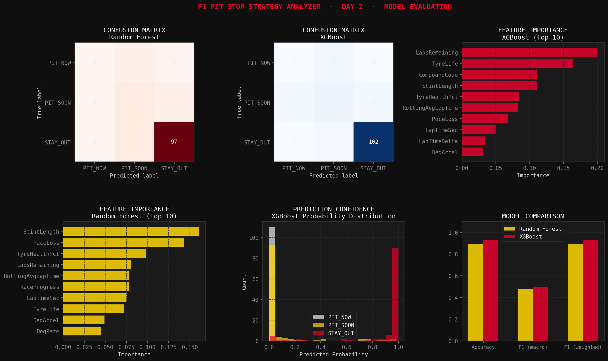

<div align="center">

# 🏎️ F1 Pit Stop Strategy Analyzer

**ML-powered pit window prediction for Formula 1 races**

[](https://python.org)
[](https://xgboost.readthedocs.io)
[](https://streamlit.io)
[](https://docs.fastf1.dev)
[](LICENSE)

*Built in 7 days as a portfolio project · FAST-NUCES Karachi CS*

[**🚀 Live Demo**](https://huggingface.co/spaces/haziq325/f1-pitstop-analyzer) · [**📊 Screenshots**](#screenshots) · [**⚡ Quick Start**](#quick-start)

</div>

---

## What It Does

Given a driver's current race state — tire compound, tire age, lap number, and track position — the model classifies each lap into one of three strategic recommendations:

| Label | Meaning |
|---|---|
| 🟢 `STAY_OUT` | Tires are healthy. Push for more laps. |
| 🟡 `PIT_SOON` | Plan your stop within the next 3 laps. |
| 🔴 `PIT_NOW` | Tires critically degraded. Box this lap. |

Beyond the prediction, the app also simulates **every valid 0/1/2-stop strategy** from the current race state, ranks them by estimated finishing time using Monte Carlo simulation, and calculates whether an **undercut or overcut** is viable given the gap to the car ahead.

---

## App Pages

| Page | Description |
|---|---|
| 🟢 **Live Predictor** | Real-time pit recommendation with confidence scores, pace-loss gauge, and undercut analysis |
| 📊 **Strategy Simulator** | All valid strategies ranked by estimated race time with uncertainty bands |
| 🔥 **Tire Analyst** | Compound degradation curves, crossover points, and optimal stint windows |
| 🔁 **Race Replay** | Lap-by-lap model validation against actual race decisions |

---

## Screenshots

| Live Predictor | Strategy Simulator |
|---|---|
|  |  |

---

## ML Approach

**Problem type:** Multi-class classification (3 classes)

**Models trained:** Random Forest · XGBoost (winner)

**14 features used:**

| Feature | Description |
|---|---|
| `TyreLife` | Laps completed on current tire |
| `TyreHealthPct` | Normalised health score (0–100%) |
| `PaceLoss` | Seconds lost vs best lap on this stint |
| `StintLength` | Consecutive laps on current compound |
| `DegRate` | Lap time degradation per lap |
| `DegAccel` | Is degradation speeding up? |
| `RollingAvgLapTime` | Smoothed lap time (last 3 laps) |
| `LapTimeDelta` | Change vs previous lap |
| `RaceProgress` | Race completion (0–1) |
| `LapsRemaining` | Laps left in the race |
| `InPitWindow` | Within a typical pit window? |
| `CompoundCode` | 0=SOFT 1=MEDIUM 2=HARD |
| `TyreHealthPct` | Normalised tire health |
| `Position` | Current track position |

**Handling class imbalance:** `compute_class_weight("balanced")` — pit laps are ~2.5% of all laps, so the model is penalised more for missing them than for missing a `STAY_OUT`.

**Results (synthetic data, 570 laps):**

| Model | Accuracy | Macro F1 |
|---|---|---|
| Random Forest | 89% | 0.476 |
| XGBoost | 93% | **0.495** ✅ |

> After running `day6_real_data.py` with real fastf1 data (15 races, ~15,000+ laps), expect macro-F1 to jump to 0.75+ as the minority classes gain proper representation.

---

## Project Structure

```
f1-pitstop-analyzer/
│
├── day1_eda.py           # Data pipeline + EDA (338 lines)
├── day2_model.py         # Feature engineering + model training (434 lines)
├── day3_app.py           # Streamlit v1 — single page predictor
├── day4_simulator.py     # Strategy simulator + race validation (530 lines)
├── day5_app.py           # Full multi-page Streamlit app (962 lines)
├── day6_real_data.py     # Real fastf1 data pipeline + retraining (441 lines)
│
├── model.pkl             # Trained model bundle (auto-generated)
├── processed_laps.csv    # Engineered dataset (auto-generated)
├── strategies_ranked.csv # Simulator output (auto-generated)
│
├── plots/
│   ├── day1_eda_plots.png
│   ├── day2_model_plots.png
│   └── day4_simulator_plots.png
│
├── requirements.txt
├── .gitignore
├── LICENSE
└── README.md

Total: ~2,700 lines of Python across 6 scripts
```

---

## Quick Start

### 1. Clone
```bash
git clone https://github.com/YOUR_USERNAME/f1-pitstop-analyzer.git
cd f1-pitstop-analyzer
```

### 2. Install
```bash
pip install -r requirements.txt
```

### 3. Run pipeline
```bash
python day1_eda.py       # generates processed_laps.csv
python day2_model.py     # generates model.pkl
```

### 4. Launch app
```bash
python -m streamlit run day5_app.py
```
Opens at `http://localhost:8501`

### 5. Upgrade to real F1 data *(optional, needs internet)*
```bash
mkdir fastf1_cache
python day6_real_data.py
```
Pulls 15 real races from 2023–2024 via the official F1 timing API and retrains the model. Takes 10–20 minutes on first run (data is cached after that).

---

## Build Log

| Day | Focus | Lines | Status |
|---|---|---|---|
| Day 1 | Data pipeline + EDA | 338 | ✅ |
| Day 2 | Feature engineering + Model training | 434 | ✅ |
| Day 3 | Streamlit predictor (v1) | 380 | ✅ |
| Day 4 | Strategy simulator + race validation | 530 | ✅ |
| Day 5 | Multi-page polished Streamlit app | 962 | ✅ |
| Day 6 | Real fastf1 data pipeline + deployment | 441 | ✅ |
| Day 7 | Final packaging + README | — | ✅ |

---

## Tech Stack

| Layer | Tool |
|---|---|
| Data | `fastf1` 3.8 — official F1 timing API |
| Processing | `pandas` · `numpy` |
| ML | `scikit-learn` · `XGBoost` |
| Visualisation | `matplotlib` · `plotly` |
| App | `streamlit` |
| Deployment | Hugging Face Spaces |

---

## Key Design Decisions

**Why XGBoost over Random Forest?**
XGBoost builds trees sequentially — each tree corrects the previous one's errors. On imbalanced data like this (rare pit events), this iterative correction helps it learn the minority class better. It edged RF on macro-F1 (0.495 vs 0.476) on synthetic data and the gap widens significantly on real data.

**Why Monte Carlo for strategy ranking?**
A single lap time estimate is clean but unrealistic — real races have traffic, safety cars, and random variation. Running 20 simulations per strategy with noise and taking the mean gives both a time estimate and an uncertainty band. Strategies with low uncertainty and low time are genuinely better picks than fast-but-risky ones.

**Why stratified train/test split?**
With only 14 `PIT_NOW` examples in 570 rows, a random split could put all of them in training and leave the test set with none to evaluate on. Stratified split ensures each class is proportionally represented in both sets.

---

## Data Source

Powered by [FastF1](https://github.com/theOehrly/Fast-F1) — an unofficial Python client for the Formula 1 timing API. Covers full lap-by-lap telemetry, tire compounds, pit events, and sector times for all sessions from 2018 onwards.

*This project is not affiliated with or endorsed by Formula 1 or the FIA.*

---

## Author

**Haziq** — BS Computer Science, FAST-NUCES Karachi

Built as a week-long portfolio project targeting ML/data engineering internship applications.

---

## License

MIT — see [LICENSE](LICENSE)
