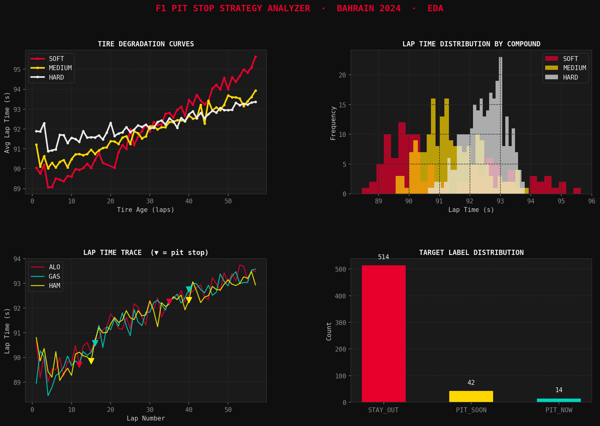

# 🏎️ F1 Pit Stop Strategy Analyzer

A machine learning project that predicts the **optimal pit stop window** for Formula 1 drivers based on tire degradation, race position, and lap time data.

Built as a week-long personal project using real F1 timing data via the `fastf1` API.

---

## 🎯 What It Does

Given a driver's current race state, the model classifies each lap into one of three strategic recommendations:

| Label | Meaning |
|---|---|
| `STAY_OUT` | Tires are fine — no pit needed |
| `PIT_SOON` | Pit within the next 3 laps |
| `PIT_NOW` | Pit this lap — tires are critically degraded |

---

## 📁 Project Structure

```
f1-pitstop-analyzer/
│
├── day1_eda.py           # Data acquisition + Exploratory Data Analysis
├── day2_model.py         # Feature engineering + Model training & evaluation
├── day3_app.py           # Streamlit web app (coming Day 3)
│
├── processed_laps.csv    # Engineered dataset output from Day 1
├── model.pkl             # Trained model bundle output from Day 2
│
├── plots/
│   ├── day1_eda_plots.png
│   └── day2_model_plots.png
│
├── requirements.txt
├── .gitignore
├── LICENSE
└── README.md
```

---

## 🗓️ Build Log

| Day | Focus | Status |
|---|---|---|
| Day 1 | Data pipeline + EDA | ✅ Done |
| Day 2 | Feature engineering + Model training | ✅ Done |
| Day 3 | Streamlit app + live predictions | ✅ Done |
| Day 4 | Strategy simulator + race validation | ✅ Done |
| Day 5 | Multi-page UI polish + tire analyst + race replay | ✅ Done |
| Day 6 | Real fastf1 data + re-train + deployment | ⏳ Upcoming |
| Day 7 | README polish + final packaging | ⏳ Upcoming |

---

## 🧠 ML Approach

**Problem type:** Multi-class classification (3 classes)

**Models trained:**
- Random Forest (200 estimators)
- XGBoost (200 estimators, sequential boosting)

**Key features used:**

| Feature | Description |
|---|---|
| `TyreLife` | Laps completed on current tire |
| `TyreHealthPct` | Normalised tire health (0–100) |
| `PaceLoss` | Seconds lost vs best lap on this stint |
| `StintLength` | Consecutive laps on current compound |
| `DegRate` | Lap time degradation per lap |
| `DegAccel` | Rate of change of degradation |
| `RaceProgress` | Race completion (0–1) |
| `LapsRemaining` | Laps left in the race |
| `RollingAvgLapTime` | Smoothed lap time (last 3 laps) |
| `InPitWindow` | Whether lap falls in a typical pit window |

**Class imbalance** handled via `compute_class_weight("balanced")` — pit laps are rare (~2.5% of all laps), so the model is penalised more for missing them.

**Current results (synthetic data, 570 rows):**

| Model | Accuracy | Macro F1 |
|---|---|---|
| Random Forest | 89% | 0.476 |
| XGBoost | 93% | **0.495** ✅ |

> Results will improve significantly once switched to real `fastf1` data (thousands of rows across multiple seasons).

---

## 🚀 Getting Started

### 1. Clone the repo
```bash
git clone https://github.com/YOUR_USERNAME/f1-pitstop-analyzer.git
cd f1-pitstop-analyzer
```

### 2. Install dependencies
```bash
pip install -r requirements.txt
```

### 3. Run Day 1 — Data + EDA
```bash
python day1_eda.py
```
Set `USE_REAL_DATA = True` at the top of the file to pull live F1 data via `fastf1`. Leave it `False` to use synthetic data offline.

### 4. Run Day 2 — Train the model
```bash
python day2_model.py
```
Reads `processed_laps.csv` from Day 1 and saves `model.pkl`.

### 5. Run the App — Launch the full multi-page UI
```bash
streamlit run day5_app.py
```

---

## 📊 Sample EDA Output



---

## 📦 Data Source

Real data powered by [FastF1](https://github.com/theOehrly/Fast-F1) — an unofficial Python client for the Formula 1 timing API. Covers full lap-by-lap telemetry, tire compounds, pit events, and sector times for all sessions from 2018 onwards.

```python
import fastf1
session = fastf1.get_session(2024, "Bahrain", "R")
session.load()
laps = session.laps   # every lap, every driver
```

---

## 🛠️ Tech Stack

- **Python 3.10+**
- `fastf1` — F1 timing data
- `pandas` / `numpy` — data manipulation
- `scikit-learn` — ML pipeline, evaluation
- `xgboost` — gradient boosting classifier
- `matplotlib` / `plotly` — visualisation
- `streamlit` — web app (Day 3+)

---

## 📌 Notes

- This project uses the **unofficial** F1 timing API via `fastf1`. It is not affiliated with or endorsed by Formula 1 or the FIA.
- Synthetic data mode (`USE_REAL_DATA = False`) generates realistic lap data matching the `fastf1` schema, useful for offline development and testing.

---

## 👤 Author

**Haziq** — CS Student at FAST-NUCES Karachi  
Building this as a portfolio project targeting internship applications.

---

## 📄 License

MIT License — see [LICENSE](LICENSE) for details.
